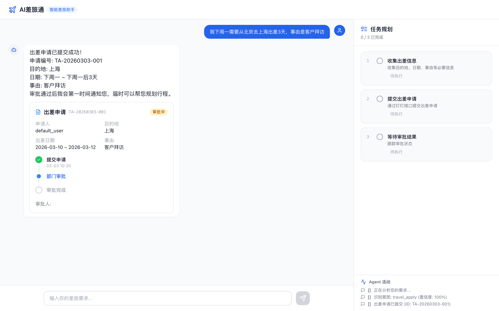
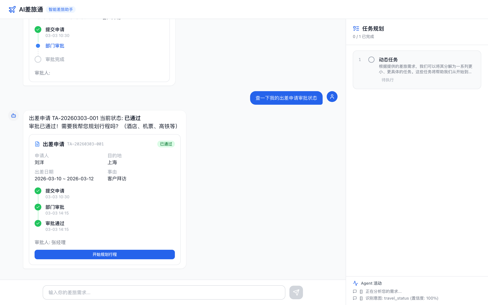
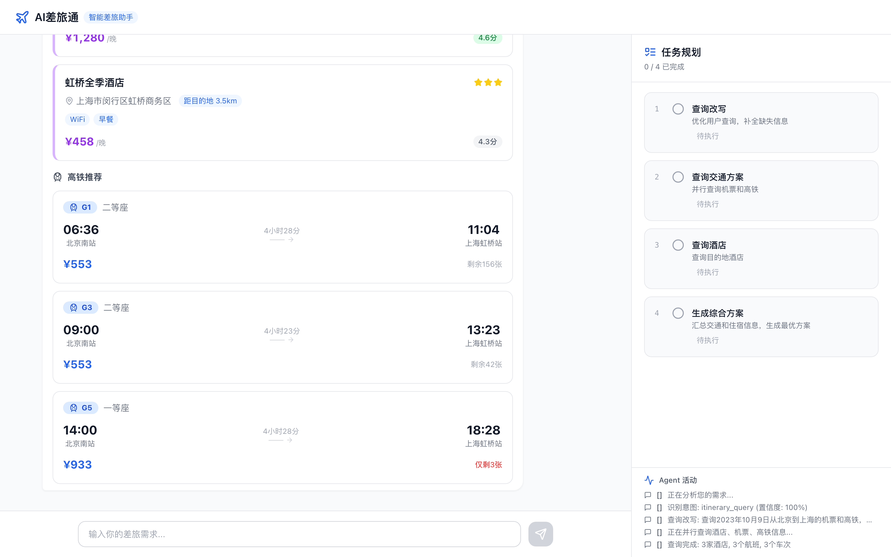
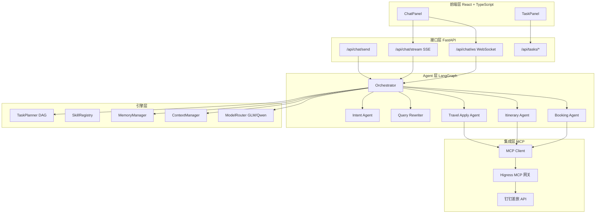

# AI差旅通（Travel Agent）

基于 LangGraph 的多智能体差旅系统，覆盖 **意图识别 → 出差申请 → 审批跟踪 → 行程规划 → 预订执行** 的完整闭环。

---

## 1. 项目亮点

- 多 Agent 编排：Orchestrator + 专职子 Agent 协同工作
- 双模型路由：GLM / Qwen 按任务特性动态分发
- MCP 集成：通过 Higress 网关统一对接钉钉差旅能力
- 流式交互：支持 SSE / WebSocket 实时回传过程事件
- 任务可视化：前端右侧面板实时展示任务拆解与执行进度

---

## 2. 核心能力展示

> 以下 3 张截图完整展示系统核心优势：多 Agent 智能编排、结构化卡片交互、全流程闭环。

### 一句话提交出差申请 — 多 Agent 协同 + 结构化卡片

用户输入一句自然语言，系统自动完成意图识别、字段提取、MCP 提交，并以结构化卡片展示申请详情（编号、目的地、日期、审批时间线），右侧任务面板实时追踪 3 步执行进度。



### 审批通过自动衔接行程规划 — 端到端工作流

审批状态卡片展示完整时间线（提交→部门审批→通过），审批通过后自动出现「开始规划行程」行动按钮，一键衔接下一阶段，无需用户手动切换流程。



### 酒店/机票/高铁一站式规划 — 并行查询 + 富交互卡片

系统并行查询酒店、机票、高铁三类资源，以统一的结构化卡片展示（价格、评分、设施、余票等），用户可直接在卡片上操作预订。右侧任务面板拆解为 4 步 DAG 执行。



---

## 3. 系统架构



更多架构图表：[系统架构](./docs/architecture/architecture.md) · [技术方案](./docs/architecture/technical-design.md) · [时序图](./docs/architecture/sequence-diagrams.md) · [流程图](./docs/architecture/flow-charts.md)

---

## 4. 核心能力与模块映射

| 能力 | 实现方式 | 关键模块 |
|---|---|---|
| 意图识别 | LLM + Prompt 模板 | `backend/app/agents/intent_agent.py` |
| 查询改写 | 上下文补全 + 实体提取 | `backend/app/agents/query_rewriter.py` |
| 多 Agent 编排 | LangGraph StateGraph | `backend/app/agents/orchestrator.py` |
| 出差申请流转 | 字段收集 + MCP 提交 + 审批查询 | `backend/app/agents/travel_apply_agent.py` |
| 行程推荐 | 并行查询 + LLM 汇总 | `backend/app/agents/itinerary_agent.py` |
| 预订执行 | 预订类型识别 + MCP 工具调用 | `backend/app/agents/booking_agent.py` |
| 任务计划 | DAG 分解 + 状态管理 | `backend/app/engine/task_planner.py` |
| 记忆与上下文治理 | 短期/长期/工作记忆 + Token 压缩 | `backend/app/engine/memory_manager.py`, `backend/app/engine/context_manager.py` |
| 模型路由 | GLM/Qwen 动态选择 | `backend/app/engine/model_router.py` |

---

## 5. 技术栈

- **后端**：Python 3.11、FastAPI、LangChain、LangGraph
- **前端**：React 18、TypeScript、TailwindCSS、Zustand
- **LLM**：智谱 GLM、阿里百炼 Qwen（双模型路由）
- **集成**：Higress MCP、钉钉差旅 API
- **存储**：Redis、PostgreSQL
- **部署**：Docker Compose

---

## 6. 快速开始

### 6.1 环境准备

```bash
cp .env.example .env
```

请在 `.env` 中至少配置：

- `GLM_API_KEY`
- `QWEN_API_KEY`

### 6.2 一键容器启动

```bash
docker compose up -d
```

### 6.3 本地开发模式

```bash
# 后端
cd backend
pip install -r requirements.txt
uvicorn app.main:app --reload --port 8000
```

```bash
# 前端
cd frontend
npm install
npm run dev
```

### 6.4 运行测试

```bash
cd backend
pytest tests/ -v
```

---

## 7. 接入真实 MCP（替换 Mock 数据）

系统内置 **Mock / 生产双模式**，开发环境下无需后端服务即可运行。当你拥有线上 MCP 接口后，可按以下步骤切换为真实数据：

### 7.1 Mock 模式原理

```text
MCPClient.__init__()
  ├─ 有 MCP_AUTH_TOKEN → 生产模式（远程 JSON-RPC 调用）
  └─ 无 MCP_AUTH_TOKEN → Mock 模式（本地 mock_data.py 返回模拟数据）
```

Mock 模式覆盖了 9 个工具：`travel_apply`、`travel_apply_status`、`get_hotel_list`、`get_hotel_detail`、`get_flights`、`get_trains`、`book_hotel`、`book_flight`、`book_train`。

### 7.2 一步切换到生产模式

在 `.env` 中配置真实的 MCP 网关地址和认证令牌：

```bash
MCP_ENDPOINT=https://your-gateway.example.com/mcp
MCP_AUTH_TOKEN=your-real-token
```

配置后重启服务，`MCPClient` 会自动走远程调用路径，**无需改动任何代码**。

### 7.3 通信协议

生产模式使用 **JSON-RPC 2.0** 协议，请求格式：

```json
{
  "jsonrpc": "2.0",
  "method": "tools/call",
  "params": {
    "name": "get_flights",
    "arguments": { "origin": "北京", "destination": "上海", "date": "2026-03-10" }
  },
  "id": 1
}
```

认证方式：`Authorization: Bearer <MCP_AUTH_TOKEN>`

### 7.4 三种接入场景

| 场景 | 操作 |
|------|------|
| **线上已是 MCP 协议**（JSON-RPC 2.0） | 仅改 `.env` 配置，零代码改动 |
| **线上是 REST API** | 方案 A：通过 Higress 网关将 REST 转 MCP；方案 B：在 `MCPClient._remote_call` 中增加适配层 |
| **字段结构不一致** | 在 `mock_data.py` 同目录下新增 `adapter.py`，做字段映射转换 |

### 7.5 注意事项

- 如果线上 API 返回字段与 Mock 数据结构不同（如 `hotel_id` → `id`），需同步调整 Agent 的字段读取逻辑
- 生产模式自带 **3 次指数退避重试**（tenacity），无需额外处理瞬时故障
- 建议先用 `list_tools` 接口验证网关连通性：`GET /health` → `POST /mcp (tools/list)`

---

## 8. API 概览

| 方法 | 路径 | 说明 |
|------|------|------|
| `GET` | `/health` | 健康检查 |
| `POST` | `/api/chat/send` | 同步聊天 |
| `POST` | `/api/chat/stream` | SSE 流式聊天 |
| `WS` | `/api/chat/ws/{session_id}` | WebSocket 聊天 |
| `GET` | `/api/tasks/{plan_id}` | 按计划 ID 查询任务 |
| `GET` | `/api/tasks/session/{session_id}` | 按会话查询任务计划 |

---

## 9. 项目结构

```text
travel-agent/
├── backend/
│   ├── app/
│   │   ├── agents/          # 多 Agent（Intent/Apply/Itinerary/Booking）
│   │   ├── api/             # FastAPI 路由（chat/tasks/health）
│   │   ├── engine/          # 引擎层（TaskPlanner/Memory/Context/ModelRouter）
│   │   ├── mcp/             # MCP 客户端 + Mock 数据
│   │   ├── models/          # Pydantic 数据模型
│   │   └── prompts/         # Prompt 模板
│   └── tests/
├── frontend/
│   └── src/
│       ├── components/      # React 组件（ChatPanel/TaskPanel/Cards）
│       ├── hooks/           # 自定义 Hook（useChat/useWebSocket）
│       ├── stores/          # Zustand 状态管理
│       └── types/           # TypeScript 类型定义
├── docs/
│   ├── architecture/        # 架构文档
│   │   ├── architecture.md
│   │   ├── technical-design.md
│   │   ├── sequence-diagrams.md
│   │   └── flow-charts.md
│   └── images/              # 截图资源
└── docker-compose.yml
```

---

## 10. 工程质量说明

- 后端核心模块已补充模块级/函数级中文注释与日志埋点
- 前端核心组件、Store、Hook 已补充 JSDoc 中文注释
- 技术文档、架构图、时序图、流程图已补齐
- README 增加核心能力截图展示区，突出产品价值

---

## 11. AI 作品提交与能力评估

本项目作为 **AI 作品提交和能力评估** 参赛作品。以下内容对应报名表各字段，可直接用于填报。

### 报名表填写参考

| 序号 | 字段 | 填写内容 |
|------|------|---------|
| 01 | **工号** | *(请填写你的 6 位数工号)* |
| 02 | **作品描述** | 基于 LangGraph 多智能体差旅系统，Orchestrator 编排 5 个子 Agent，通过 MCP 协议对接钉钉差旅，实现意图识别→申请→审批→行程→预订全闭环 |
| 03 | **作品演示链接** | *(部署后填写演示地址，或填写本仓库 GitHub 链接)* |
| 04 | **作品截图** | 见下方截图（不超过 3 张，建议选取：欢迎页、出差申请流程、行程规划卡片） |

### 作品核心亮点

- **多 Agent 协同**：Orchestrator 编排 5 个专职子 Agent（意图识别、查询改写、出差申请、行程规划、预订执行），职责清晰、可独立演进
- **双模型路由**：GLM / Qwen 按任务特性动态分发，兼顾效果与成本
- **MCP 标准协议**：通过 Higress 网关统一对接企业 API，支持 Mock / 生产无缝切换
- **流式交互体验**：SSE + WebSocket 实时回传过程事件，任务面板可视化执行进度
- **结构化卡片展示**：酒店、机票、高铁、审批状态等以富交互卡片呈现

### 作品截图（建议提交 3 张）

| 截图 | 核心优势 |
|------|---------|
| `docs/images/core-apply.png` | 多 Agent 协同 — 一句话自动完成意图识别→字段提取→MCP提交 |
| `docs/images/core-approval.png` | 端到端工作流 — 审批时间线 + 自动衔接行程规划 |
| `docs/images/core-itinerary.png` | 结构化卡片 — 酒店/机票/高铁并行查询 + 富交互展示 |

### 技术文档

| 文档 | 路径 |
|------|------|
| 技术方案 | [`docs/architecture/technical-design.md`](./docs/architecture/technical-design.md) |
| 系统架构 | [`docs/architecture/architecture.md`](./docs/architecture/architecture.md) |
| 时序图 | [`docs/architecture/sequence-diagrams.md`](./docs/architecture/sequence-diagrams.md) |
| 流程图 | [`docs/architecture/flow-charts.md`](./docs/architecture/flow-charts.md) |
