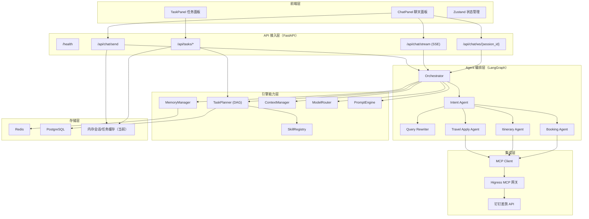
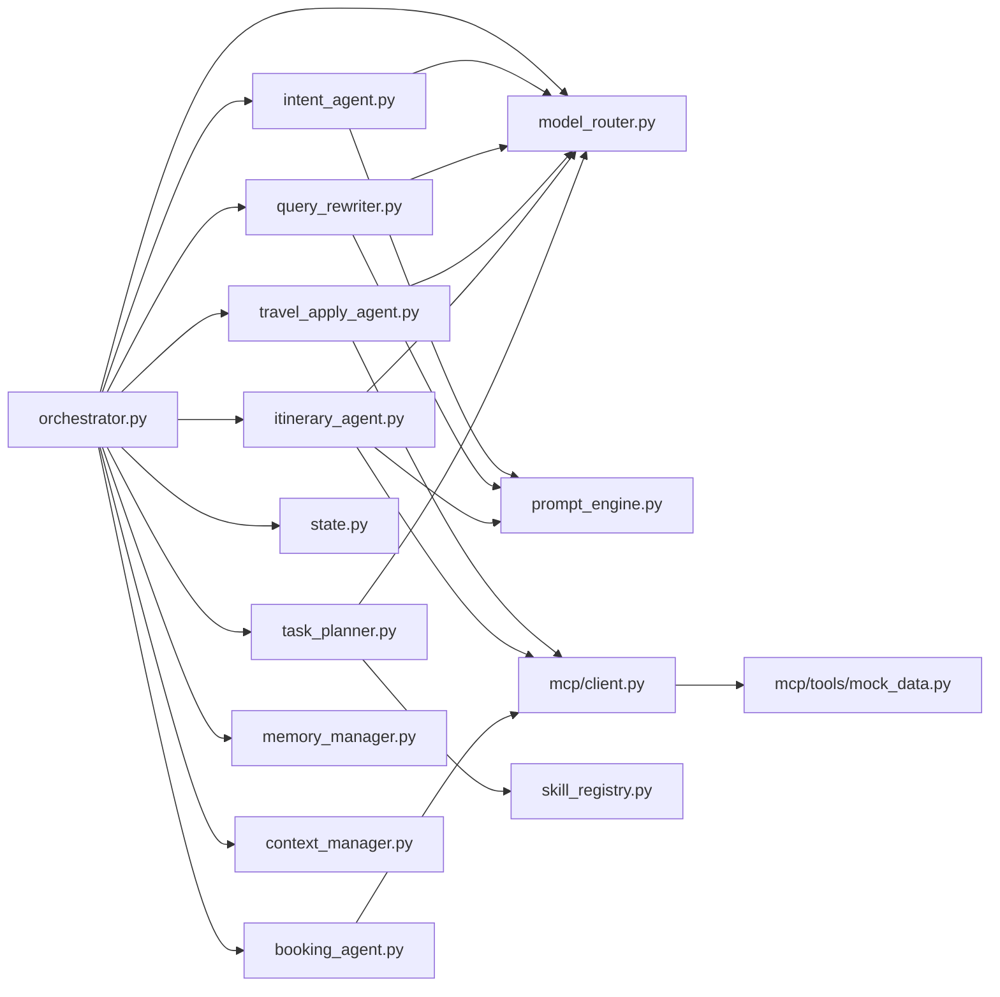
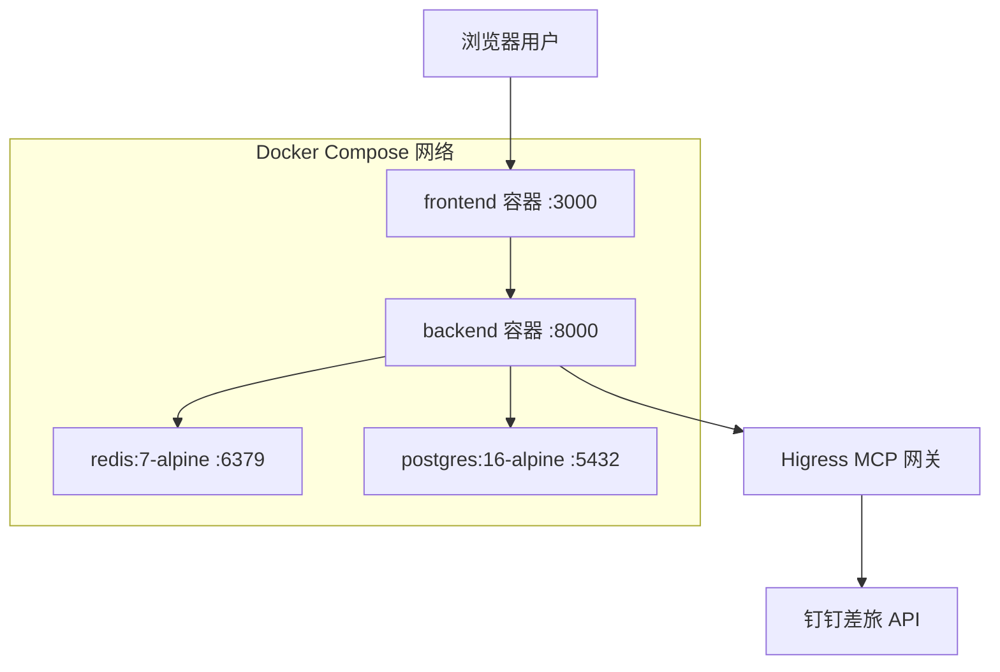

# AI差旅通架构图

本文档给出系统级、模块级和部署级的 Mermaid 架构图。  
设计细节请参考 [技术方案文档](./technical-design.md)。

## 1. 系统架构图（分层）

## 2. 核心模块依赖图

## 3. 部署架构图（Docker Compose）

---

更多交互流程请参考 [时序图文档](./sequence-diagrams.md) 与 [流程图文档](./flow-charts.md)。
