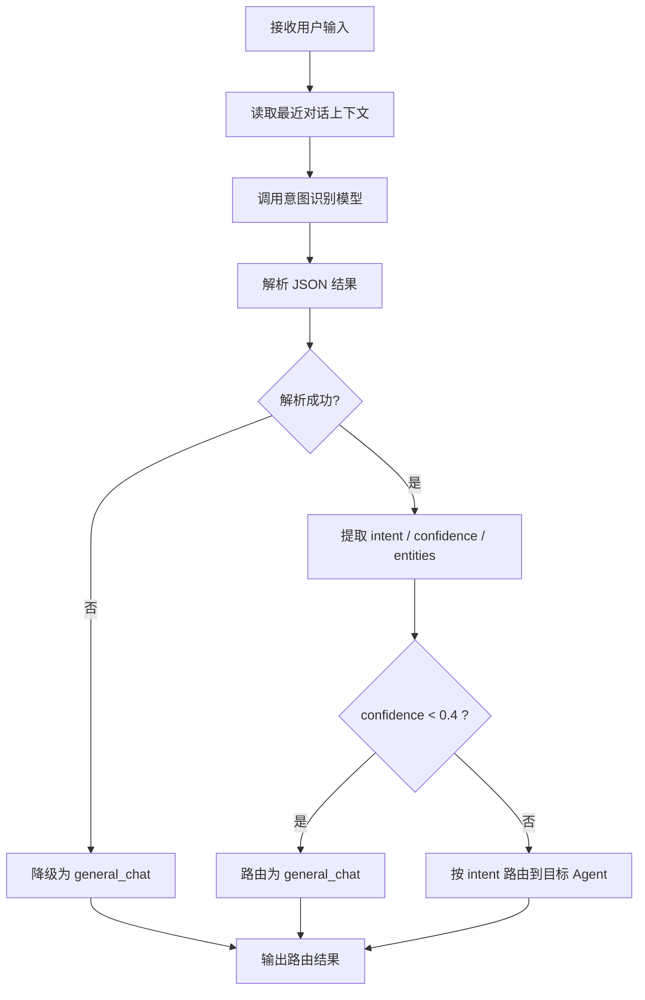
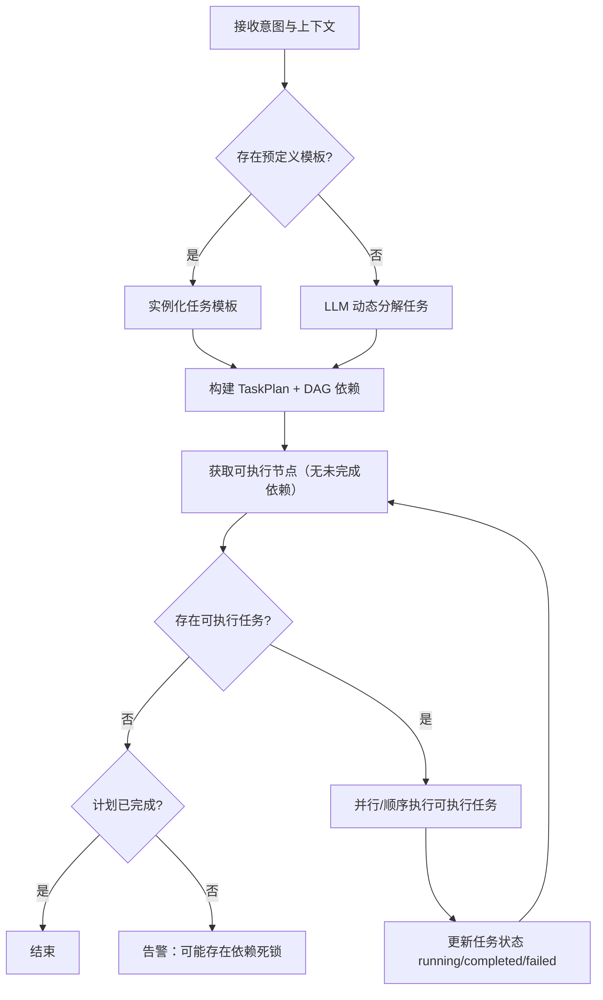
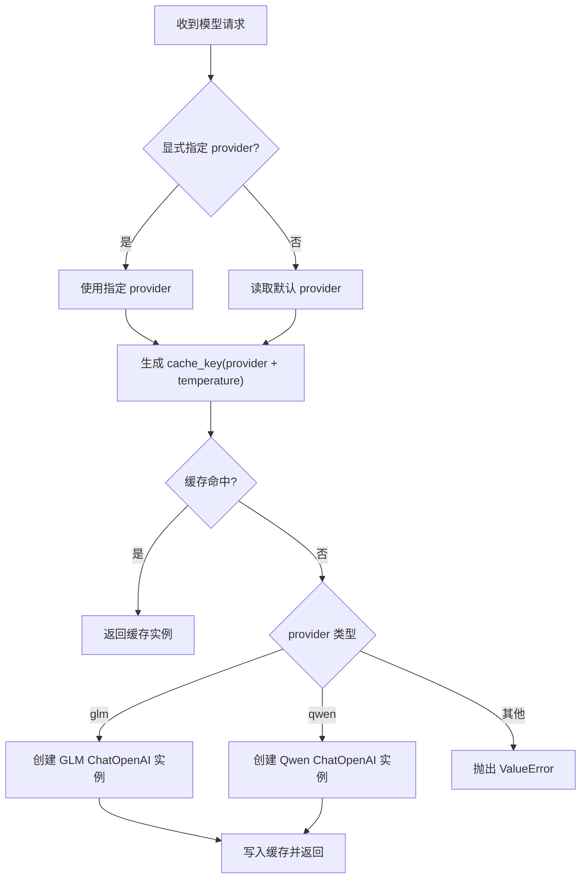
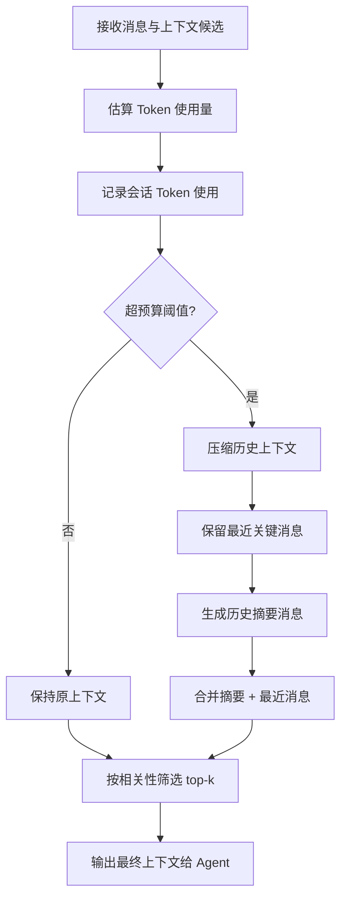

# AI差旅通流程图

本文档聚焦核心算法与业务流程。  
若需查看系统分层和模块关系，请参考 [架构图文档](./architecture.md)。

## 1. 意图识别流程

```mermaid
flowchart TD
    A["接收用户输入"] --> B["读取最近对话上下文"]
    B --> C["调用意图识别模型"]
    C --> D["解析 JSON 结果"]
    D --> E{"解析成功?"}
    E -- 否 --> F["降级为 general_chat"]
    E -- 是 --> G["提取 intent / confidence / entities"]
    G --> H{"confidence < 0.4 ?"}
    H -- 是 --> I["路由为 general_chat"]
    H -- 否 --> J["按 intent 路由到目标 Agent"]
    F --> K["输出路由结果"]
    I --> K
    J --> K
```

## 2. 任务规划与执行流程（DAG）

```mermaid
flowchart TD
    A["接收意图与上下文"] --> B{"存在预定义模板?"}
    B -- 是 --> C["实例化任务模板"]
    B -- 否 --> D["LLM 动态分解任务"]
    C --> E["构建 TaskPlan + DAG 依赖"]
    D --> E
    E --> F["获取可执行节点（无未完成依赖）"]
    F --> G{"存在可执行任务?"}
    G -- 否 --> H{"计划已完成?"}
    H -- 是 --> I["结束"]
    H -- 否 --> J["告警：可能存在依赖死锁"]
    G -- 是 --> K["并行/顺序执行可执行任务"]
    K --> L["更新任务状态 running/completed/failed"]
    L --> F
```

## 3. 模型路由决策流程

```mermaid
flowchart TD
    A["收到模型请求"] --> B{"显式指定 provider?"}
    B -- 是 --> C["使用指定 provider"]
    B -- 否 --> D["读取默认 provider"]
    C --> E["生成 cache_key(provider + temperature)"]
    D --> E
    E --> F{"缓存命中?"}
    F -- 是 --> G["返回缓存实例"]
    F -- 否 --> H{"provider 类型"}
    H -- glm --> I["创建 GLM ChatOpenAI 实例"]
    H -- qwen --> J["创建 Qwen ChatOpenAI 实例"]
    H -- 其他 --> K["抛出 ValueError"]
    I --> L["写入缓存并返回"]
    J --> L
```

## 4. 上下文管理流程

```mermaid
flowchart TD
    A["接收消息与上下文候选"] --> B["估算 Token 使用量"]
    B --> C["记录会话 Token 使用"]
    C --> D{"超预算阈值?"}
    D -- 否 --> E["保持原上下文"]
    D -- 是 --> F["压缩历史上下文"]
    F --> G["保留最近关键消息"]
    G --> H["生成历史摘要消息"]
    H --> I["合并摘要 + 最近消息"]
    E --> J["按相关性筛选 top-k"]
    I --> J
    J --> K["输出最终上下文给 Agent"]
```
