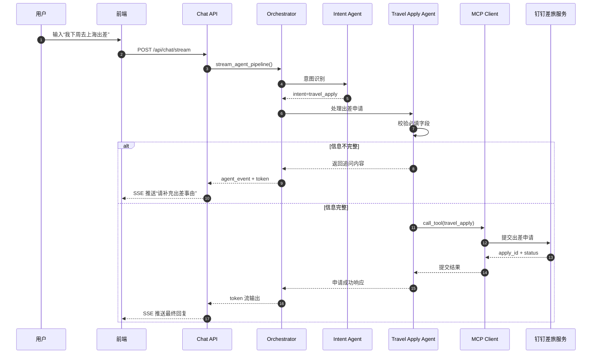
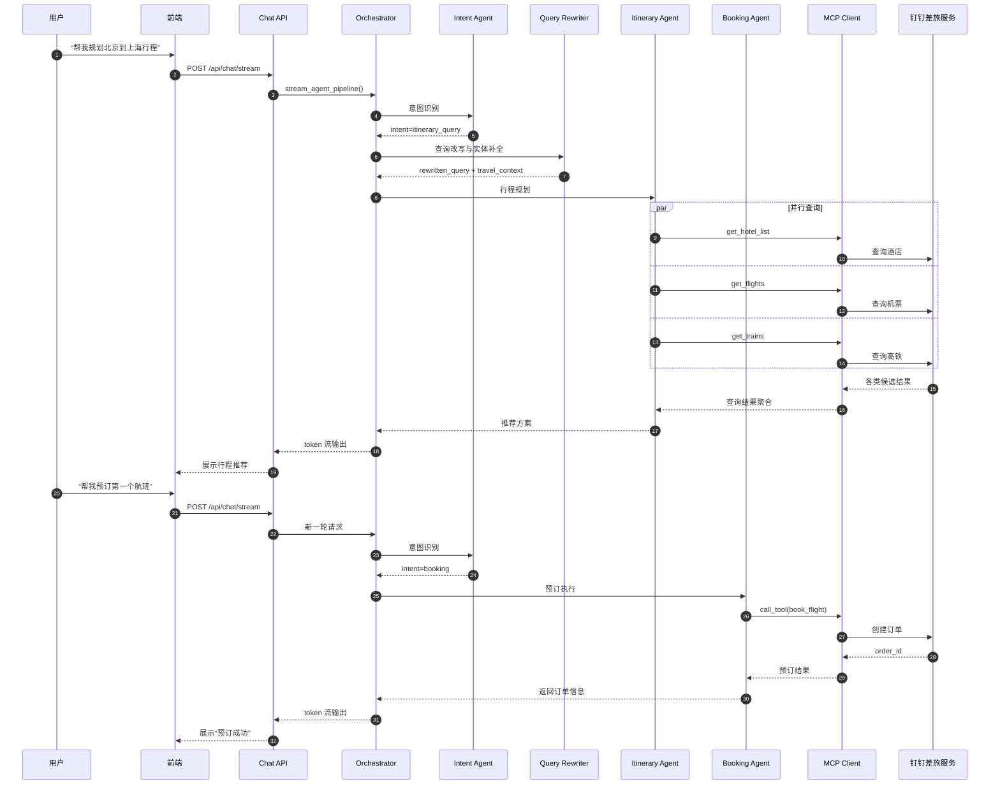
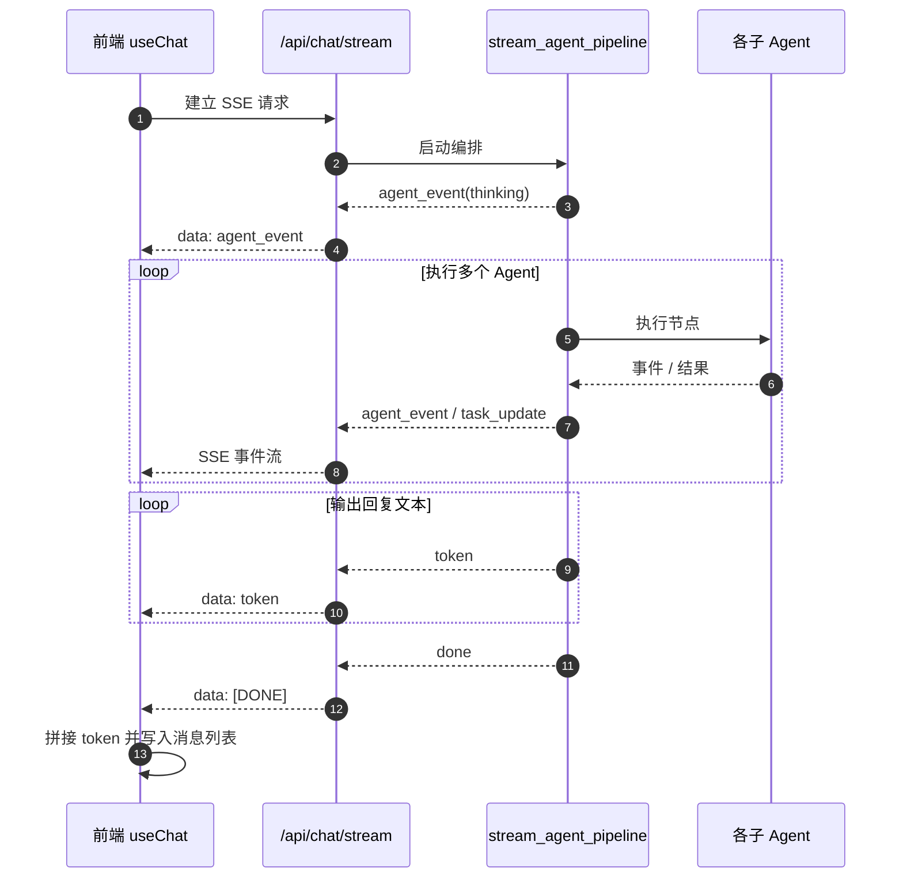
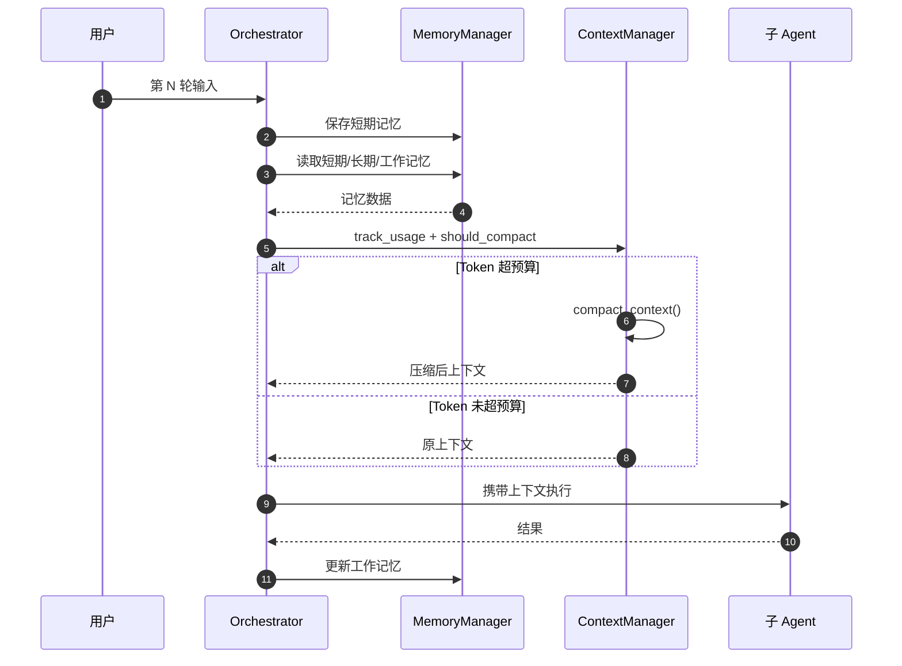

# AI差旅通时序图

本文档展示核心业务链路的交互时序。  
架构背景请先阅读 [架构图文档](./architecture.md)。

## 1. 出差申请完整流程

```mermaid
sequenceDiagram
    autonumber
    participant U as 用户
    participant FE as 前端
    participant API as Chat API
    participant ORC as Orchestrator
    participant IA as Intent Agent
    participant TA as Travel Apply Agent
    participant MCP as MCP Client
    participant DD as 钉钉差旅服务

    U->>FE: 输入“我下周去上海出差”
    FE->>API: POST /api/chat/stream
    API->>ORC: stream_agent_pipeline()
    ORC->>IA: 意图识别
    IA-->>ORC: intent=travel_apply
    ORC->>TA: 处理出差申请
    TA->>TA: 校验必填字段
    alt 信息不完整
        TA-->>ORC: 返回追问内容
        ORC-->>API: agent_event + token
        API-->>FE: SSE 推送“请补充出差事由”
    else 信息完整
        TA->>MCP: call_tool(travel_apply)
        MCP->>DD: 提交出差申请
        DD-->>MCP: apply_id + status
        MCP-->>TA: 提交结果
        TA-->>ORC: 申请成功响应
        ORC-->>API: token 流输出
        API-->>FE: SSE 推送最终回复
    end
```

## 2. 行程规划与预订流程

```mermaid
sequenceDiagram
    autonumber
    participant U as 用户
    participant FE as 前端
    participant API as Chat API
    participant ORC as Orchestrator
    participant IA as Intent Agent
    participant QR as Query Rewriter
    participant IT as Itinerary Agent
    participant BK as Booking Agent
    participant MCP as MCP Client
    participant DD as 钉钉差旅服务

    U->>FE: “帮我规划北京到上海行程”
    FE->>API: POST /api/chat/stream
    API->>ORC: stream_agent_pipeline()
    ORC->>IA: 意图识别
    IA-->>ORC: intent=itinerary_query
    ORC->>QR: 查询改写与实体补全
    QR-->>ORC: rewritten_query + travel_context
    ORC->>IT: 行程规划
    par 并行查询
        IT->>MCP: get_hotel_list
        MCP->>DD: 查询酒店
    and
        IT->>MCP: get_flights
        MCP->>DD: 查询机票
    and
        IT->>MCP: get_trains
        MCP->>DD: 查询高铁
    end
    DD-->>MCP: 各类候选结果
    MCP-->>IT: 查询结果聚合
    IT-->>ORC: 推荐方案
    ORC-->>API: token 流输出
    API-->>FE: 展示行程推荐

    U->>FE: “帮我预订第一个航班”
    FE->>API: POST /api/chat/stream
    API->>ORC: 新一轮请求
    ORC->>IA: 意图识别
    IA-->>ORC: intent=booking
    ORC->>BK: 预订执行
    BK->>MCP: call_tool(book_flight)
    MCP->>DD: 创建订单
    DD-->>MCP: order_id
    MCP-->>BK: 预订结果
    BK-->>ORC: 返回订单信息
    ORC-->>API: token 流输出
    API-->>FE: 展示“预订成功”
```

## 3. SSE 流式交互时序

```mermaid
sequenceDiagram
    autonumber
    participant FE as 前端 useChat
    participant API as /api/chat/stream
    participant ORC as stream_agent_pipeline
    participant AG as 各子 Agent

    FE->>API: 建立 SSE 请求
    API->>ORC: 启动编排
    ORC-->>API: agent_event(thinking)
    API-->>FE: data: agent_event

    loop 执行多个 Agent
        ORC->>AG: 执行节点
        AG-->>ORC: 事件 / 结果
        ORC-->>API: agent_event / task_update
        API-->>FE: SSE 事件流
    end

    loop 输出回复文本
        ORC-->>API: token
        API-->>FE: data: token
    end

    ORC-->>API: done
    API-->>FE: data: [DONE]
    FE->>FE: 拼接 token 并写入消息列表
```

## 4. 多轮对话上下文管理时序

```mermaid
sequenceDiagram
    autonumber
    participant U as 用户
    participant ORC as Orchestrator
    participant MM as MemoryManager
    participant CM as ContextManager
    participant AG as 子 Agent

    U->>ORC: 第 N 轮输入
    ORC->>MM: 保存短期记忆
    ORC->>MM: 读取短期/长期/工作记忆
    MM-->>ORC: 记忆数据
    ORC->>CM: track_usage + should_compact
    alt Token 超预算
        CM->>CM: compact_context()
        CM-->>ORC: 压缩后上下文
    else Token 未超预算
        CM-->>ORC: 原上下文
    end
    ORC->>AG: 携带上下文执行
    AG-->>ORC: 结果
    ORC->>MM: 更新工作记忆
```
